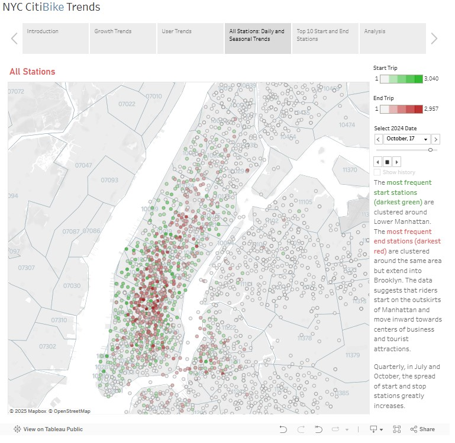

# CitiBike-Dashboard
Tableau Dashboard - Data Analytics Course Module 18

# Task

# Methodology
## Data Selection and Cleaning

I selected the following files from the New York Citi Bike trip data for the year 2024:
 - 202401 (January)
 - 202404 (April)
 - 202407 (July)
 - 202410 (October)

The zip files for July and October were extremely large, containing between 5-6 CSV files each, resulting in millions of rows of data. I read in and concatenated the datasets into Pandas DataFrames. After removing null values, I created a new dataset for each month that sampled 5% of the original data, resulting in much more manageable file sizes while maintaining the integrity and precision of the data. Finally, I combined the cleaned individual month files into one ny_citibike_2024.csv.

## Dashboard: Growth Trends

### Ridership Growth by Bike Type
### Total Trips per Week: 2024 Quarters

## Dashboard: User Trends

### Trip Duration: Member vs Casual User
### Weekday Frequency: Member vs Casual User
### Peak Hours

## Dashboard: Dynamic Map

## Results

The dashboard is available here: [Tableau](https://public.tableau.com/app/profile/hannah.miles.kingrey/viz/citibike_analysis_17392480645700/Story1).

## Analysis

